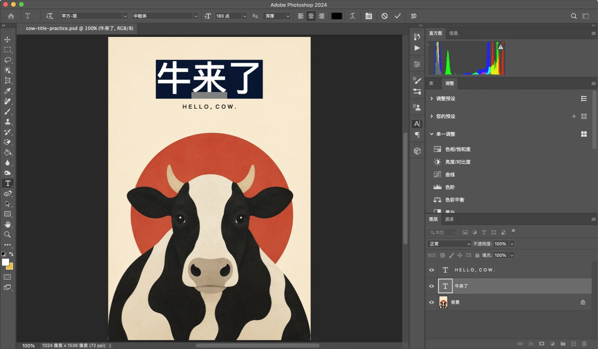
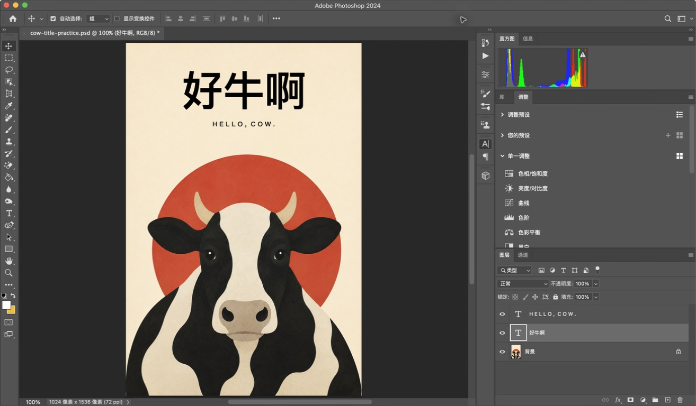
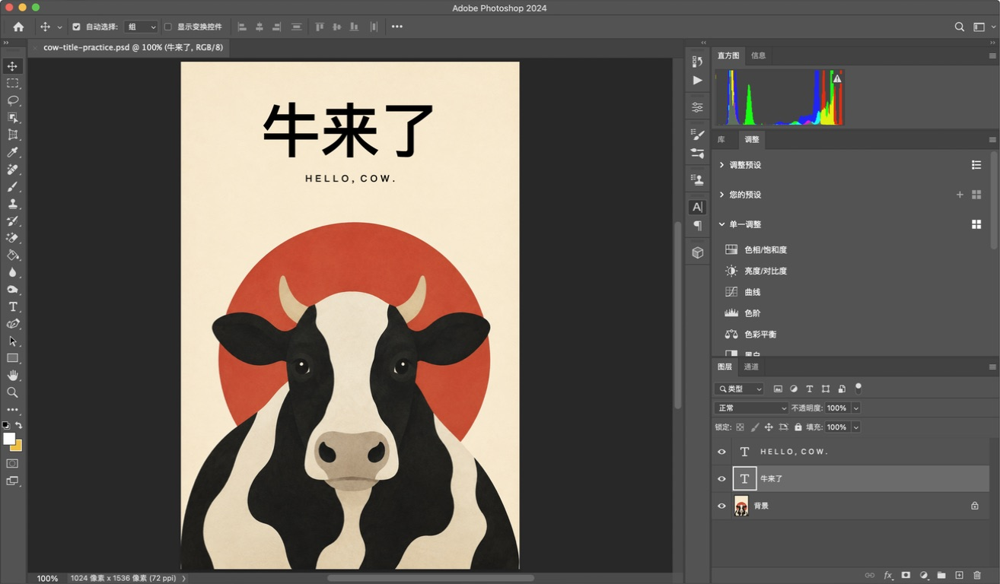

# Photoshop 案例：把「牛来了」改成自己的标题

## 起点与目标

用户先让 Agent 制作牛主题海报，随后加载 software-quickstart，并选择“修改标题文字”。教学直接围绕现有 PSD 进行。

工程含英文文字、中文标题和背景三个部分。牛、红色圆形与底色在同一张插画中；文字可以独立编辑。这个结构决定了本次适合教授标题替换，而不是假定画面中的每个物件都可独立移动。

## 阅读和练习

下载完整仓库后，用浏览器打开本目录的 [index.html](index.html)。截图和 PSD 都在相对路径下，可以离线使用；Adobe 参考链接需要联网。

- [practice.psd](practice.psd)：开始时标题为“牛来了”。
- [finished.psd](finished.psd)：演示完成后标题为“好牛啊”。
- [操作证据记录](assets/evidence.json)：截图对应的状态与验证信息。

截图里使用的英文工程名与下载文件名不同，这是整理公开副本时的命名变化。

## 演示过程

先在图层面板中辨认中文标题。T 图标意味着该层仍然是文字，而不是背景插画的一部分。

双击标题左侧的 T 图标，画布上的三个字被选中。双击图层名称会进入重命名，它与修改画布文字不是同一件事。

将选中的文字替换为“好牛啊”，再用顶部的勾号确认。原插画、英文及既有文字格式保留。

示范还验证了通过“编辑”菜单还原文字修改，并将新版本另存为 PSD。公开包省略保存对话框截图，因为其中显示了与案例无关的本机目录。

## 验证范围

原案例记录于 2026-09-07，环境为 macOS / Adobe Photoshop 2024 / 中文界面。原任务实际演示了打开 PSD、选择与替换标题、确认、撤销及另存为。发布整理复核了已有截图、文件与链接，不将复核描述成又一次 Photoshop 实操。

尚未测试所有系统、输入法、字体替换或自定义快捷键组合。案例不证明用户已独立学会，也不提供学习时间的统计结论。

## 素材与公开范围

- 牛的插画为本项目中通过 AI 生成的素材，随后在 Photoshop 加入独立文字。
- 截图来自实际 Photoshop 操作，页面中的黄色框是额外教学标注。
- 软件界面、软件商标和字体相关权利属于相应权利人；仓库不包含软件或字体安装文件。缺少同名字体时 Photoshop 可能提示替换。
- 公开包仅包含本案例所需的指南、选定截图与两个 PSD，不包含原始聊天日志、本机备份或其他项目资料。
- 参考：[Adobe 编辑文字](https://helpx.adobe.com/photoshop/using/editing-text.html)、[Adobe 字符格式](https://helpx.adobe.com/photoshop/using/formatting-characters.html)。
